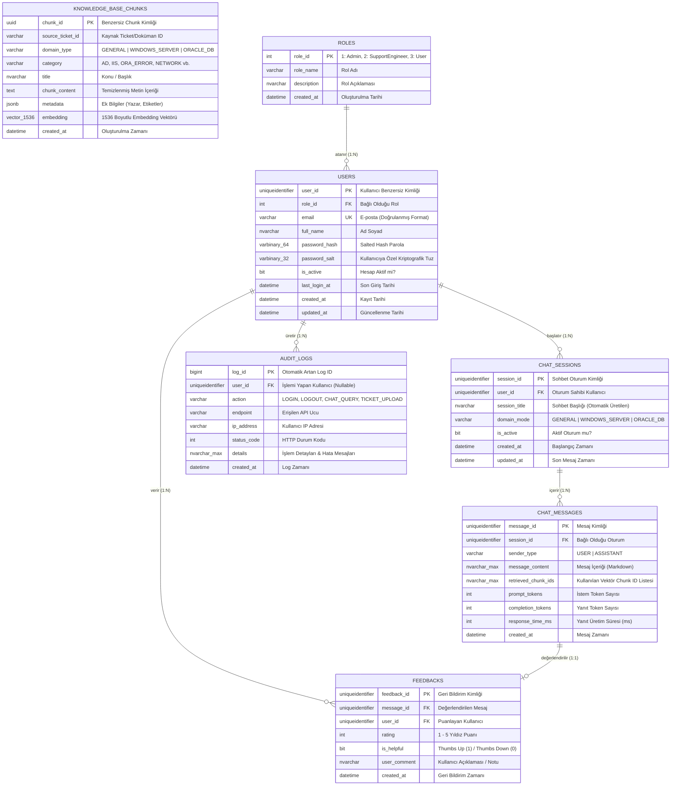

# 📑 PROJE BAŞLANGIÇ KRİTERLERİ VE MİMARİ TASARIM RAPORU

**Proje Adı:** Akıllı Servis Masası ve Sistem Uzmanı Chatbot Geliştirme  
**Proje Kodu:** PRJIC20260201  
**Tarih:** 2026-08-24  
**Versiyon:** 1.0.0  

---

## 1. LLM Model Seçimi ve Gerekçelendirme Raporu

### 1.1. Model Karşılaştırma Matrisi

Teknik destek, Windows Server ve Oracle DB uzmanlığı gereksinimleri doğrultusunda değerlendirilen modellerin teknik karşılaştırması aşağıdaki tabloda özetlenmiştir:

| Kriter / Özellik | **OpenAI GPT-4o-mini** | **Meta Llama 3 (8B / 70B Instruct)** | **Mistral (7B-Instruct / Small)** |
| :--- | :--- | :--- | :--- |
| **Model Türü & Dağıtım** | Bulut API (SaaS) | Açık Kaynak / Self-Hosted veya Bulut API | Açık Kaynak / API (Mistral AI) |
| **Maliyet (1M Token)** | **Giriş:** $0.15 <br> **Çıkış:** $0.60 | **Self-Hosted:** GPU Altyapı Maliyeti <br> **Groq/Together:** $0.05 - $0.70 | **API:** $0.20 - $0.60 <br> **Self-Hosted:** GPU Maliyeti |
| **Yanıt Süresi (Latency & TTFT)** | **Çok Düşük** (TTFT: ~200-300ms, 80-100 token/s) | **Orta - Yüksek** (8B: Hızlı ~150ms; 70B için yüksek GPU bant genişliği gerekir) | **Düşük - Orta** (Mistral 7B: ~250ms, Mixtral: ~400ms) |
| **Bağlam Penceresi (Context Window)** | **128,000 Token** (Geniş doküman ve uzun chat geçmişi için ideal) | **8,000 - 128,000 Token** (Llama 3 8k, Llama 3.1 128k) | **32,000 Token** |
| **PowerShell & Windows Server Kabiliyeti** | **Çok Yüksek** (Active Directory cmdlets, IIS konfigürasyon XML'leri, Event Log analiz scriptleri) | **Yüksek** (Temel cmdletler başarılı, karmaşık GPO ve script bloklarında prompt hassasiyeti var) | **Orta** (Genel scriptler başarılı, derin Windows API/cmdlet bilgisi sınırlı) |
| **Oracle DB & SQL / PL-SQL Optimizasyonu** | **Çok Yüksek** (Explain Plan analizi, ORA-XXXX hata çözümleri, Tablespace scriptleri, RMAN) | **Yüksek** (Standard SQL başarılı, Oracle spesifik PL/SQL ve RMAN'de fine-tuning önerilir) | **Orta - Yüksek** (Postgres/MySQL ağırlıklı, Oracle spesifik ORA hata kodlarında zayıf kalabiliyor) |
| **Markdown & Kod Formatına Uyum (Guardrails)** | **Mükemmel** (Sistem direktiflerine ve strict markdown sözdizimine tam sadakat) | **İyi** (Kısa çıktılarda başarılı, bazen açıklama metinleri kod bloğu dışına taşabilir) | **İyi** (Standart markdown çıktıları üretebilir) |
| **Donanım / Bakım İhtiyacı** | **Sıfır** (Tamamen yönetilen servis) | **Yüksek** (70B için en az 2x A100/H100 GPU veya vLLM/Ollama altyapısı) | **Orta** (7B için 1x RTX 4090 / 16GB VRAM yeterli) |

---

### 1.2. Model Seçimi ve Gerekçelendirme

#### **Seçilen Birincil Model: OpenAI GPT-4o-mini**

**Gerekçeler:**
1. **Yüksek Fiyat/Performans Dengesi:** GPT-4o-mini, GPT-4 seviyesindeki mantıksal akıl yürütme ve kod üretim kabiliyetini önceki nesil GPT-3.5 modellerinden bile daha düşük bir maliyetle ($0.15/1M giriş tokeni) sunmaktadır.
2. **Kusursuz PowerShell ve Oracle PL/SQL Desteği:** Windows Server Active Directory (`Get-ADUser`, `Set-ADAccountPassword`), IIS AppCmd ve Oracle ORA hata kodları (örn: `ORA-01653`, `ORA-00060`) üzerindeki eğitim derinliği ve çözüm üretme doğruluğu diğer küçük açık kaynak modellere göre belirgin şekilde üstündür.
3. **Strict Markdown Formatlama ve Sistem Direktiflerine Uyum:** Projenin kritik gereksinimlerinden biri olan "SQL ve PowerShell kodlarının mutlaka standart Markdown bloklarında (` ```sql `, ` ```powershell `) döndürülmesi" kuralına sıfır hata ile uymaktadır.
4. **Geniş Bağlam Penceresi (128k Token):** RAG sürecinde benzer ticket parçalarının ve çok turlu konuşma geçmişinin (Sliding Window Memory) tek bir istemde kayıpsız iletilmesini sağlar.

#### **Embedding Modeli Seçimi: `text-embedding-3-small` (1536 Boyut)**
- **Neden:** Türkçe ve İngilizce teknik destek metinlerinde yüksek anlamsal benzerlik skoru üretmesi, `pgvector` HNSW indeksi ile milisaniye seviyesinde Cosine Similarity araması yapabilmesi ve düşük boyutuyla veritabanı I/O performansını maksimize etmesi sebebiyle tercih edilmiştir.

---

## 2. RAG Akış Mimarisi (RAG Flow)

Aşağıdaki diyagram; kullanıcı sorusunun alınmasından başlayarak, vektör arama, domain-spesifik prompt zenginleştirme, LLM yanıt üretimi ve arayüzde streaming olarak gösterilmesine kadar olan uçtan uca veri akışını göstermektedir:

```mermaid
flowchart TD
    subgraph UI_Katmani["🖥️ Kullanıcı Arayüzü (Frontend - Dark Mode)"]
        A[Kullanıcı Soruyu Yazar & Modu Seçer\n'Genel' | 'Windows Server' | 'Oracle DB'] --> B[Token & Oturum Doğrulama\n'Bearer JWT']
        B --> C[SSE / WebSocket Bağlantısı Başlatılır]
    end

    subgraph API_Katmani["⚙️ Backend API & Güvenlik Katmanı (.NET 8 / FastAPI)"]
        C --> D[JWT Middleware & RBAC Kontrolü]
        D --> E{Kullanıcı Yetkili mi?}
        E -- Hayır --> E_Fail[401/403 Hata Döndür]
        E -- Evet --> F[Audit Log Kaydı Oluştur]
        F --> G[Sohbet Belleği Yükle\n'Son N Mesaj: Sliding Window']
    end

    subgraph Embedding_Vector_Katmani["🔍 Vektör Arama & Bilgi Tabanı"]
        G --> H[Embedding Servisi\n'text-embedding-3-small']
        H --> I[(PostgreSQL + pgvector\n'HNSW Index - Cosine Similarity')]
        I --> J[Top-K Benzer Ticket & Doküman Parçaları\n'Similarity Threshold >= 0.70']
    end

    subgraph Prompt_Orchestration["🧠 Prompt Mühendisliği & Guardrails (LangChain/Semantic Kernel)"]
        J --> K[Prompt Assembler]
        K --> L1[Domain System Prompt\n'Windows Server' | 'Oracle DBA' | 'IT Helpdesk']
        K --> L2[Retrieved Context\n'İlgili Ticket/Doküman Parçaları']
        K --> L3[Conversation History\n'Önceki Kullanıcı/Asistan Mesajları']
        K --> L4[Negative Guardrail\n'Yetersiz bilgide uydurma yapma!']
    end

    subgraph LLM_Response_Katmani["🚀 LLM & Yanıt İşleme"]
        K --> M[LLM Engine\n'OpenAI GPT-4o-mini']
        M --> N[Streaming Token Üretimi]
        N --> O[Markdown Kod Bloğu Denetimi\n'```powershell / ```sql']
        O --> P[(MSSQL Veritabanı\n'ChatMessages & Tokens Kaydet')]
        O --> Q[Frontend SSE Stream & Canlı Markdown Render]
    end

    subgraph Feedback_Dongusu["⭐ Geri Bildirim Döngüsü"]
        Q --> R[Kullanıcı Yanıtı Puanlar\n'Thumbs Up/Down / 1-5 Yıldız']
        R --> S[(MSSQL Feedbacks Tablosu)]
    end

    classDef ui fill:#1e293b,stroke:#38bdf8,stroke-width:2px,color:#ffffff;
    classDef api fill:#0f172a,stroke:#818cf8,stroke-width:2px,color:#ffffff;
    classDef vector fill:#134e4a,stroke:#2dd4bf,stroke-width:2px,color:#ffffff;
    classDef prompt fill:#4c1d95,stroke:#c084fc,stroke-width:2px,color:#ffffff;
    classDef llm fill:#701a75,stroke:#f472b6,stroke-width:2px,color:#ffffff;
    classDef feedback fill:#78350f,stroke:#fbbf24,stroke-width:2px,color:#ffffff;

    class A,B,C,Q,R ui;
    class D,E,E_Fail,F,G api;
    class H,I,J vector;
    class K,L1,L2,L3,L4 prompt;
    class M,N,O,P llm;
    class S feedback;
```

---

## 3. Veritabanı ER Diyagramı (Database Architecture)

Sistem hibrit veritabanı mimarisi kullanmaktadır:
1. **PostgreSQL (`pgvector`):** Yüksek boyutlu vektör embedding'leri ve doküman parçalarının benzerlik araması için.
2. **MSSQL:** Kullanıcı yönetimi (Salted Hash), RBAC rolleri, sohbet oturumları, detaylı mesaj geçmişi, denetim logları ve geri bildirim puanları için.



---

## 4. Güvenlik ve Veri Bütünlüğü Standartları

1. **Parola Güvenliği:** Parolalar SHA-256 gibi zayıf algoritmalarla değil, kullanıcı bazlı rastgele üretilen 32-byte salt ile birlikte **Argon2id** veya **PBKDF2** (en az 100,000 iterasyon) ile hashlenerek saklanır.
2. **Kullanıcı İzolasyonu:** Her sohbet sorgusunda JWT içerisindeki `UserId` claim'i okunarak kullanıcının yalnızca kendi `session_id` verilerine erişimi garanti altına alınır; başkasının sohbet geçmişine erişim engellenir (IDOR koruması).
3. **Vektör Eşzamanlılığı:** Bilgi tabanına yeni bir ticket veya doküman eklendiğinde PostgreSQL `knowledge_base_chunks` tablosuna anlık yazılır ve `CHAT_MESSAGES.retrieved_chunk_ids` alanı üzerinden hangi cevabın hangi doküman parçasından üretildiği şeffaf biçimde denetlenebilir (Traceability).
