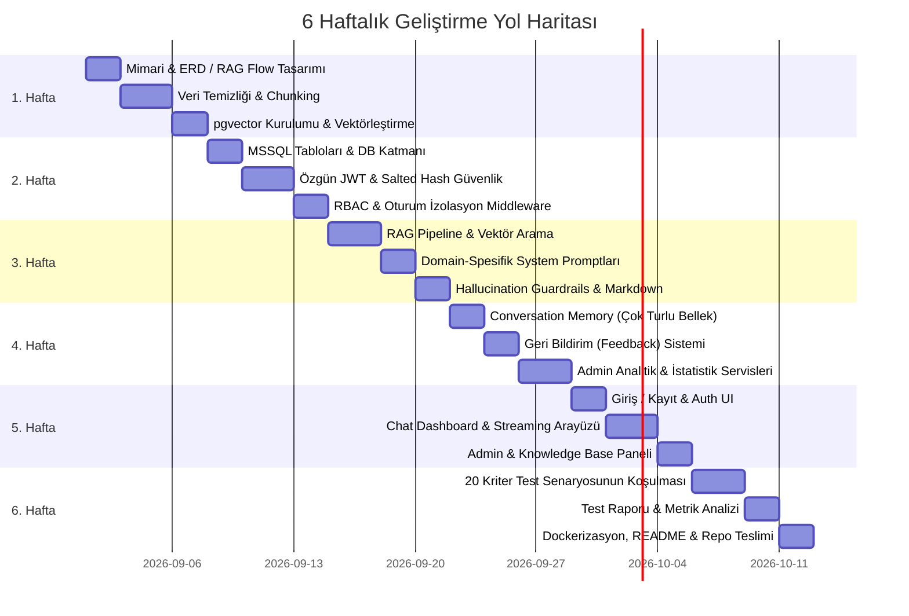

# 📋 Akıllı Servis Masası ve Sistem Uzmanı Chatbot — 6 Haftalık Proje Çalışma Planı

| Bilgi Alanı | Detay |
| :--- | :--- |
| **Proje Başlığı:** | Akıllı Servis Masası ve Sistem Uzmanı Chatbot Geliştirme |
| **Proje Numarası:** | PRJIC20260201 |
| **Proje Süresi:** | 6 Hafta |
| **Proje Kapsamı:** | Açık kaynak ticket verilerini analiz eden, kurumsal Windows Server ve Oracle DB konularında uzmanlaşmış RAG tabanlı Yapay Zeka Destek Mühendisi Asistanı. |
| **Mimari Standartlar:** | n-Katmanlı/Modüler Mimari, PostgreSQL (`pgvector`) + MSSQL Hibrit Veritabanı, Özgün JWT Güvenlik Mimarisi, SOLID & Clean Code, Asenkron Programlama, Dark Mode Destekli UI. |

---

## 🗓️ Genel Zaman Çizelgesi (Gantt Şeması)



---

## 📌 1. HAFTA: Analiz, Mimari Tasarım ve Veri Ön İşleme (Başlangıç Kriterleri)

> **Hedef:** Proje başlangıç kriterlerini eksiksiz teslim etmek ve veri setini vektörleştirmeye hazır hale getirmek.

### Yapılacak İşler ve Adımlar:
1. **Mimari & Model Seçimi Raporu:**
   - LLM seçimi (Örn: OpenAI API / GPT-4o-mini veya açık kaynak Llama 3 / Mistral) ve gerekçelendirilmesi (maliyet, latency, bağlam penceresi).
   - Embedding modelinin belirlenmesi (örn: `text-embedding-3-small` veya açık kaynak `bge-m3` / `all-MiniLM-L6-v2`).
   - RAG akış diyagramının (RAG Flow Diagram) hazırlanması.
   - Veritabanı ER diyagramının hazırlanması (`Users`, `Roles`, `Tickets`, `KnowledgeBaseChunks`, `ChatSessions`, `Messages`, `Feedbacks`, `AuditLogs`).
2. **Veri Seti Temizliği & Chunking:**
   - Kaggle IT Tickets, Ubuntu Dialogues ve Stack Exchange veri setlerinden Windows Server, Oracle DB ve Servis Masası verilerinin derlenmesi.
   - Regex/Python ile gürültülü verilerin temizlenmesi (HTML tagleri, kişisel/hassas veriler, anlamsız karakterler).
   - Metinlerin anlamsal bütünlüğü koruyacak şekilde parçalanması (512–1024 token, %10–20 overlap).
3. **Vektör Veritabanı Kurulumu:**
   - PostgreSQL üzerinde `pgvector` eklentisinin aktif edilmesi.
   - Çıkarılan embedding'lerin PostgreSQL'e HNSW / IVFFlat indeksleri ile kaydedilmesi.

* **Haftalık Çıktılar:**
  - `docs/architecture/rag_flow_diagram.png`
  - `docs/architecture/database_erd.png`
  - `docs/reports/model_selection_report.md`
  - Vektörleştirilmiş ve sorgulanabilir PostgreSQL Bilgi Tabanı.

---

## 📌 2. HAFTA: Veritabanı, Güvenlik ve Kimlik Doğrulama (Auth Modülü)

> **Hedef:** Güvenli kullanıcı altyapısını ve ilişkisel veri tabanını kurmak; hazır kütüphane yerine özgün JWT altyapısını kodlamak.

### Yapılacak İşler ve Adımlar:
1. **MSSQL & PostgreSQL Bağlantıları:**
   - MSSQL üzerinde kullanıcılar, roller, denetim logları (Audit Logs), sohbet oturumları ve geri bildirim tablolarının oluşturulması.
2. **Özgün JWT & Güvenlik Mimarisi:**
   - E-posta format doğrulaması (RFC 5322 Regex).
   - Parola karmaşıklık kontrolü (en az 8 karakter, büyük-küçük harf, rakam ve özel karakter zorunluluğu).
   - Parolaların veritabanında Salted Hash (Argon2 / BCrypt / PBKDF2) yöntemiyle geri döndürülemez şekilde şifrelenmesi.
   - Access Token (JWT) ve Refresh Token mekanizmasının özgün olarak yazılması.
3. **Yetkilendirme (RBAC) & Oturum İzolasyonu:**
   - `User` ve `Admin` rollerinin kurgulanması.
   - Kullanıcıların sadece kendi sohbet geçmişine erişebileceği güvenlik middleware / guard yapısının kurulması.

* **Haftalık Çıktılar:**
  - `POST /api/auth/register` (Doğrulamalı kayıt)
  - `POST /api/auth/login` (JWT üretimi)
  - `POST /api/auth/refresh`
  - MSSQL DDL / Migration scriptleri ve Güvenlik Testleri.

---

## 📌 3. HAFTA: RAG Hattı, Arama & Uzman Sistem Promptları

> **Hedef:** Windows Server ve Oracle DB konularında uzmanlaşmış RAG motorunu ayağa kaldırmak ve prompt mühendisliğini tamamlamak.

### Yapılacak İşler ve Adımlar:
1. **RAG Orkestrasyonu (LangChain / Semantic Kernel):**
   - Kullanıcı sorgusunun embedding vektörüne çevrilmesi.
   - `pgvector` üzerinden Cosine Similarity / HNSW ile en yakın ticket ve doküman parçalarının çekilmesi (Retrieval).
   - Eşik değer (similarity threshold) ve Top-K (Top-3 / Top-5) ayarlarının yapılması.
2. **Domain-Spesifik System Prompt Tasarımı:**
   - **Genel Servis Masası Modu:** Sorunu ticket geçmişiyle eşleştiren, adım adım rehberlik eden asistan promptu.
   - **Windows Server Uzmanı Modu:** Active Directory, IIS ve Event Log analizine odaklanan; doğrudan çalıştırılabilir PowerShell komutları üreten sistem promptu.
   - **Oracle DB Uzmanı Modu:** Tablespace, SQL execution plan optimizasyonu, RMAN yedekleme/kurtarma adımlarını DBA bakış açısıyla veren sistem promptu.
3. **Guardrails & Formatlama Kuralları:**
   - **Hallucination Control:** Bağlamda veya uzmanlık alanında yeterli bilgi yoksa uydurmayı engelleyen, bilmediğini açıkça belirten prompt direktifleri.
   - **Markdown Kod Formatı:** SQL sorgularının (` ```sql `) ve PowerShell scriptlerinin (` ```powershell `) standart bloklarda döndürülmesi kuralı.

* **Haftalık Çıktılar:**
  - Çalışır durumda RAG Pipeline servisi.
  - Mod bazlı dinamik System Prompt kütüphanesi ve Guardrail kuralları.

---

## 📌 4. HAFTA: Backend Entegrasyonu, Sohbet Belleği ve Admin Metrikleri

> **Hedef:** Chat oturumlarını, konuşma geçmişini (Memory) ve admin analiz/log altyapısını tamamlamak.

### Yapılacak İşler ve Adımlar:
1. **Konuşma Geçmişi ve Bellek (Conversation Memory):**
   - Çok turlu diyaloglar için son $N$ mesajın bağlama eklenmesi (Sliding Window Memory / Summary Memory).
   - Oturum bazlı chat geçmişinin (`ChatSessions` & `Messages`) MSSQL/PostgreSQL'de asenkron olarak saklanması.
2. **Geri Bildirim & Değerlendirme Sistemi:**
   - Kullanıcının chatbot yanıtlarına thumbs up/down ve 1–5 puan verebilmesi için feedback endpoint'lerinin yazılması.
3. **Admin Raporlama Servisleri:**
   - En çok sorgulanan etiketler (Active Directory, Oracle ORA hataları, vb.), toplam mesaj sayısı ve bot başarı puanı ortalamasını hesaplayan aggregate sorguların geliştirilmesi.

* **Haftalık Çıktılar:**
  - `POST /api/chat/send` (Memory & RAG entegrasyonu)
  - `GET /api/chat/sessions` & `GET /api/chat/history/{sessionId}`
  - `POST /api/feedback`
  - `GET /api/admin/metrics`

---

## 📌 5. HAFTA: Kullanıcı Arayüzü (UI/UX) ve Yönetim Paneli

> **Hedef:** Modern, Dark Mode destekli, akıcı ve responsive bir ön yüz geliştirmek.

### Yapılacak İşler ve Adımlar:
1. **Kullanıcı & Giriş Ekranları:**
   - Login ve Register ekranları (parola kuralları validasyon uyarıları ve anlık geri bildirim ile).
2. **Chat Dashboard (Ana Ekran):**
   - **Sol Panel:** Geçmiş oturumlar listesi, arama çubuğu ve "Yeni Sohbet" butonu.
   - **Mod Seçici:** Genel Destek, Windows Server Uzmanı, Oracle DB Uzmanı hızlı seçim butonları.
   - **Mesaj Akışı:** Markdown render desteği, kod bloklarında **"Kopyala"** butonu, sözdizimi vurgulama (syntax highlighting) ve mesaj puanlama alanı.
   - **Streaming Yanıt:** SSE (Server-Sent Events) veya WebSocket ile token bazlı kelime kelime akış.
3. **Admin & Bilgi Merkezi Paneli:**
   - Admin için yeni ticket/doküman metni yükleme alanı.
   - Raporlama grafikleri (en çok sorulan kategoriler, chatbot başarı oranı ve kullanım grafikleri).
4. **Tema:**
   - Göz yormayan, modern Dark Mode ve Light Mode geçişi.

* **Haftalık Çıktılar:**
  - Modern Web Arayüzü (React / Angular / Streamlit).
  - Dark Mode & Streaming destekli Chat Dashboard ve Admin Paneli.

---

## 📌 6. HAFTA: Kapsamlı Testler, Raporlama ve Proje Teslimi (Tamamlanma Kriterleri)

> **Hedef:** Belirlenen 20 test senaryosunu koşmak, test raporunu üretmek, projeyi dockerize edip teslim paketini hazırlamak.

### Yapılacak İşler ve Adımlar:
1. **20 Kriter Test Senaryosunun Koşulması:**
   - **10 Servis Masası Senaryosu:** Şifre sıfırlama, VPN bağlantı hatası, yazıcı kuyruğu kilitlenmesi, Outlook senkronizasyon problemi, ağ sürücüsü eşleme, lisans hatası vb.
   - **5 Windows Server Senaryosu:** Active Directory kullanıcı kilidi/GPO uygulama, IIS 500.19 hatası, Event Viewer 4625 analizi, DNS flush & servis yeniden başlatma, disk alanı genişletme vb.
   - **5 Oracle DB Senaryosu:** ORA-01653 (unable to extend tablespace), High CPU tüketen SQL sorgusunun Explain Plan ile tespiti, RMAN incremental backup alma, Session kilitlenmesi (blocking sessions) çözümü, Index rebuild senaryosu vb.
2. **Kapsamlı Test Raporunun Hazırlanması:**
   - Test girişleri, beklenen çıktılar, modelin ürettiği yanıtlar, gecikme süresi (latency) ve doğruluk puanlarının tablolaştırılması.
3. **Repository ve Dokümantasyon Hazırlığı:**
   - Temiz Git commit geçmişi.
   - Veritabanı migration / SQL tohumlama scriptleri.
   - Detaylı `README.md` (Kurulum adımları, mimari şema ve çevre değişkenleri `.env.example`).
   - Tek komutla ayağa kaldırmak için `Dockerfile` ve `docker-compose.yml` yapılandırması.

* **Haftalık Çıktılar:**
  - `docs/TEST_REPORT.md` (20 senaryonun detaylı sonuçları)
  - `docker-compose.yml` & `Dockerfile`
  - `README.md`
  - Teslimata hazır Git Deposu.

---

## 📊 Haftalık Teslimat & Kontrol Matrisi

| Hafta | Temel Aşama | Kritik Teslimat | Doğrulama Kriteri |
| :--- | :--- | :--- | :--- |
| **1. Hafta** | Analiz, Mimari & Veri | ERD, RAG Flow, Vektör Veritabanı | `pgvector` üzerinde benzerlik sorgusunun çalışması |
| **2. Hafta** | Veritabanı & Güvenlik | MSSQL Şeması, Özgün JWT, RBAC | Yetkisiz kullanıcının başkasının sohbetine erişememesi |
| **3. Hafta** | RAG & Uzman Promptlar | RAG Pipeline, Promptlar, Guardrails | PowerShell ve SQL çıktılarının hatasız Markdown formatında gelmesi |
| **4. Hafta** | Backend & Hafıza | Sohbet Belleği, Feedback & Metrik API | Çok turlu konuşmada bağlamın korunması ve feedback kaydı |
| **5. Hafta** | UI/UX & Yönetim Paneli | Dark Mode Chat Ekranı & Admin Paneli | Streaming yanıt akışı, kod kopyalama ve grafik gösterimi |
| **6. Hafta** | Test, Raporlama & Teslim | 20 Senaryo Test Raporu, Docker, Repo | 20 senaryonun başarıyla doğrulanması ve `docker-compose up` testi |
