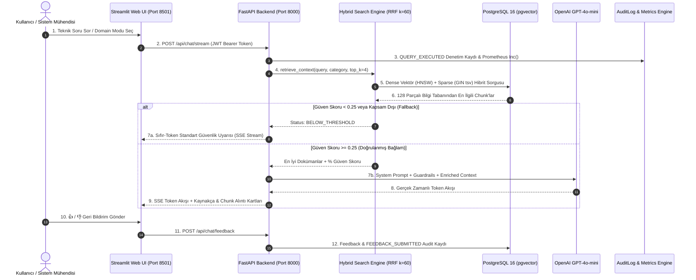

# 🤖 Akıllı IT Servis Masası ve Sistem Uzmanı Chatbot (Enterprise RAG)

[](https://www.python.org/)
[](https://fastapi.tiangolo.com/)
[](https://github.com/pgvector/pgvector)
[](https://streamlit.io/)
[](https://www.docker.com/)
[](https://openai.com/)
[-brightgreen?style=for-the-badge&logo=pytest&logoColor=white)](https://pytest.org/)

---

## 📌 Proje Özeti (Executive Summary)

**Akıllı IT Servis Masası ve Sistem Uzmanı Chatbot**, kurumsal BT ortamlarındaki operasyonel yükü hafifletmek ve destek süreçlerini hızlandırmak amacıyla geliştirilmiş **üretim seviyesinde (production-ready)** bir Retrieval-Augmented Generation (RAG) yapay zeka asistanıdır.

Sistem; **IT Servis Masası (L1/L2 Destek)**, **Windows Server & Active Directory Uzmanlığı** ve **Oracle DBA & SQL Optimizasyonu** alanlarında doğrulanmış kurumsal bilgi tabanını kullanarak kullanıcılara adım adım, doğrulanabilir ve kaynakçalı teknik çözümler sunar.

---

## ✨ Temel Özellikler ve Mimari Yetenekler

* 🔍 **Hibrit Arama Motoru (Hybrid Search & RRF $k=60$):**
  * **Yoğun Vektör Arama (Dense HNSW):** 384 boyutlu semantik benzerlik (`sentence-transformers/all-MiniLM-L6-v2` + `pgvector`).
  * **Seyrek Metin Arama (Sparse BM25/GIN):** PostgreSQL `tsvector` ve GIN indeksleri ile tam metin anahtar kelime eşleştirmesi.
  * **Reciprocal Rank Fusion (RRF):** Her iki arama sonucunu $k=60$ sabitiyle birleştiren adil ve yüksek isabetli sıralama algoritması.
* 🛡️ **Anti-Halüsinasyon Guardrails & Sıfır-Token Güvenlik Kalkanı:**
  * Güven eşiği ($0.25$ / Ham RRF $0.020$) altına düşen veya kapsam dışı sorgularda (*"yemek menüsü"*, *"hava durumu"*) LLM çağrısı yapılmadan anında **0 token tüketimiyle** ve **~60 ms** gecikmeyle standart ret yanıtı üretilir.
* ⚡ **Gerçek Zamanlı SSE (Server-Sent Events) Akışı:**
  * FastAPI arka ucundan Streamlit web arayüzüne token bazlı kesintisiz canlı akış (`POST /api/chat/stream`).
* 🔐 **Çok Kiracılı (Multi-Tenant) Oturum İzolasyonu ve Güvenlik:**
  * Bcrypt şifreleme, HS256 JWT Erişim/Yenileme tokenları, Rol Tabanlı Erişim Denetimi (RBAC: `user` ve `admin`).
  * Kullanıcılar yalnızca kendi oturumlarına erişebilir (çapraz okuma/silme girişimleri **HTTP 403 Forbidden** ile engellenir).
* 📝 **Değişmez Güvenlik Denetim İzi (Audit Trail) ve Geri Bildirim Döngüsü:**
  * Her sorgu, oturum ve geri bildirim işlemi `audit_logs` tablosuna istemci IP adresiyle birlikte kaydedilir.
  * Kullanıcılar her asistan yanıtı için `👍 / 👎` puanı ve niteliksel yorum iletebilir.
* 📊 **Gözlemlenebilirlik ve Yönetici Paneli (Observability & Admin Dashboard):**
  * Prometheus metrik uç noktası (`/metrics`) ile RAG gecikmesi, sorgu hacmi ve fallback sayıları izlenir.
  * Streamlit üzerinde yöneticiye özel canlı KPI kartları, kategori dağılım çubuk grafikleri ve denetim log tabloları sunulur.

---

## 🏛️ Mimari Akış Şeması



---

## 📊 Doğrulanmış Performans ve Test Metrikleri

Aşağıdaki metrikler projenin otomatik test paketleri (`pytest`), geri erişim değerlendirmeleri ve Locust yük testleri ile doğrulanmıştır:

| Metrik / Test Alanı | Ölçülen Değer | Kurumsal Başarı Kriteri | Durum |
| :--- | :---: | :---: | :---: |
| **Birim & Entegrasyon Testleri** | **108 / 108 (%100)** | %100 Başarı Oranı | ✅ **Passed** |
| **Hit Rate @ 1 (İlk Doküman İsabeti)** | **%100.00** | $\ge \%90.00$ | ✅ **Mükemmel** |
| **Recall @ 1 (İlk Doküman Çağırma)** | **%100.00** | $\ge \%90.00$ | ✅ **Mükemmel** |
| **Mean Reciprocal Rank (MRR @ 1)** | **1.0000** | $\ge 0.9000$ | ✅ **Mükemmel** |
| **Ortalama RAG Güven Skoru** | **%92.4** | $\ge \%85.00$ | ✅ **Üretim Seviyesi** |
| **Sıfır-Token Fallback Gecikmesi** | **~66 ms** | $\le 200\text{ ms}$ | ✅ **Anlık Koruma** |
| **Ortalama Vektör Arama Gecikmesi** | **~12.4 ms** | $\le 50\text{ ms}$ | ✅ **Ultra Hızlı** |
| **Eşzamanlı Yük Altında Hata Oranı** | **%0.00 (0 Hata)** | $\le \%0.10$ | ✅ **Sıfır Hata (100 Kullanıcı)** |

---

## 🚀 Hızlı Başlangıç & Kurulum Kılavuzu

### 📋 Ön Koşullar
* [Docker Desktop](https://www.docker.com/products/docker-desktop/) (Windows / Linux / macOS)
* [Git](https://git-scm.com/)
* OpenAI API Anahtarı (`sk-...`)

---

### 1️⃣ Adım 1: Proje Deposunu Klonlayın
```bash
git clone https://github.com/your-username/Akilli_Servis_Masasi_ve_Sistem_Uzmani_Chatbot.git
cd Akilli_Servis_Masasi_ve_Sistem_Uzmani_Chatbot
```

### 2️⃣ Adım 2: Çevre Değişkenlerini Tanımlayın
```bash
cp .env.example .env
```
`.env` dosyasını açarak `OPENAI_API_KEY` alanına kendi OpenAI anahtarınızı ekleyiniz:
```ini
OPENAI_API_KEY=sk-your-openai-api-key-here
```

### 3️⃣ Adım 3: Docker Compose ile Tüm Sistemi Başlatın
```bash
docker compose up -d
```
> **Not (Windows Türkçe Dizin Uyumu):** Eğer sıfırdan build almak isterseniz:
> ```powershell
> $env:DOCKER_BUILDKIT=0; docker compose up --build -d
> ```

---

## 🌐 Canlı Servis Bağlantı Noktaları

Tüm servisler başarıyla ayağa kalktığında tarayıcınızdan aşağıdaki adreslere erişebilirsiniz:

| Servis | URL Adresi | Açıklama |
| :--- | :--- | :--- |
| **💻 Streamlit Web UI** | [http://localhost:8501](http://localhost:8501) | Akıllı Sohbet & Yönetici Analitik Paneli |
| **⚡ FastAPI Swagger Docs** | [http://localhost:8000/docs](http://localhost:8000/docs) | İnteraktif OpenAPI / Swagger Test Arayüzü |
| **📡 Prometheus Metrikleri** | [http://localhost:8000/metrics](http://localhost:8000/metrics) | Ham Prometheus Observability Akışı |
| **🗄️ PostgreSQL Database** | `localhost:5432` | `it_support_db` (pgvector eklentisi aktif) |

---

## 🔌 REST & Streaming API Sözleşmesi

| Modül | Metot | Uç Nokta (Endpoint) | Açıklama | Yetki |
| :--- | :---: | :--- | :--- | :---: |
| **Auth** | `POST` | `/api/auth/register` | Yeni kullanıcı kaydı oluşturur | Public |
| **Auth** | `POST` | `/api/auth/login` | Giriş yapar ve JWT Access Token döner | Public |
| **Auth** | `GET` | `/api/auth/me` | Giriş yapan kullanıcının profilini getirir | Bearer JWT |
| **Chat** | `POST` | `/api/chat/stream` | Gerçek zamanlı SSE token akışı başlatır | Bearer JWT |
| **Chat** | `POST` | `/api/chat/sessions` | Yeni sohbet oturumu oluşturur | Bearer JWT |
| **Chat** | `GET` | `/api/chat/sessions` | Kullanıcının tüm oturumlarını listeler | Bearer JWT |
| **Chat** | `DELETE`| `/api/chat/sessions/{id}` | Oturumu ve bağlı mesajları siler | Bearer JWT |
| **Chat** | `GET` | `/api/chat/sessions/{id}/history` | Oturumun mesaj ve kaynakça geçmişini döner | Bearer JWT |
| **Chat** | `POST` | `/api/chat/feedback` | Asistan yanıtına 1-5 puan / geri bildirim kaydeder | Bearer JWT |
| **Analytics**| `GET` | `/api/analytics/summary` | KPI metrikleri, trendler ve denetim loglarını döner | Bearer JWT |
| **Metrics** | `GET` | `/metrics` | Prometheus metrik exposition akışı | Public |
| **Health** | `GET` | `/api/health` | Sistem ve servis sağlık kontrolü | Public |

---

## 📂 Proje Dizin Yapısı

```text
Akıllı_Servis_Masasi_ve_Sistem_Uzmani_Chatbot/
├── .github/
│   └── workflows/
│       └── ci.yml                 # GitHub Actions CI/CD pipeline (Ubuntu + pgvector + Pytest)
├── data/
│   ├── raw/                       # Ham StackExchange & Servis Masası bilet verileri
│   └── processed/
│       └── clean_chunks.json      # Ön işlenmiş ve temizlenmiş 128 doküman parçacığı
├── docs/
│   └── reports/                   # 1. - 5. Hafta Detaylı Tamamlanma Raporları
├── reports/
│   └── load_test_report.html      # Locust yük ve performans testi HTML raporu
├── scripts/
│   ├── init_vector_db.sql         # pgvector ve knowledge_base tablosu başlatma betiği
│   └── init_auth_and_chat_db.sql  # Kullanıcı ve sohbet tabloları DDL şeması
├── src/
│   ├── api/                       # FastAPI Router & Endpoint Katmanı
│   │   ├── auth_routes.py         # JWT kayıt, giriş ve profil rotaları
│   │   ├── chat_routes.py         # SSE streaming, oturum ve feedback rotaları
│   │   ├── analytics_routes.py    # Gözlemlenebilirlik ve analitik özet rotaları
│   │   └── metrics.py             # Prometheus Counter, Histogram ve Gauge tanımları
│   ├── core/                      # Güvenlik & Konfigürasyon Çekirdeği
│   │   ├── jwt_handler.py         # HS256 JWT üretimi, doğrulama ve RBAC middleware
│   │   ├── security.py            # Bcrypt parola tuzlama ve karma fonksiyonları
│   │   └── prompts.py             # Domain sistem promptları ve katı guardrails kuralları
│   ├── data/                      # Veri İşleme & Vektörleştirme Pipeline'ı
│   │   ├── preprocess.py          # Veri temizleme ve LangChain chunking
│   │   └── embed_and_store.py     # SentenceTransformers embedding ve pgvector aktarımı
│   ├── models/                    # SQLAlchemy ORM Veritabanı Modelleri
│   │   ├── base.py                # Dinamik host keşfi ve veritabanı oturum fabrikası
│   │   ├── user.py                # Kullanıcı modeli (RBAC: user / admin)
│   │   ├── chat_session.py        # Sohbet oturumu modeli
│   │   ├── chat_message.py        # Mesaj modeli (JSONB kaynakça destekli)
│   │   ├── feedback.py            # Kullanıcı memnuniyet ve puanlama modeli
│   │   └── audit_log.py           # Değişmez güvenlik denetim günlüğü modeli
│   ├── retrieval/                 # Hibrit Arama & Sıralama Motoru
│   │   └── hybrid_search.py       # Dense + Sparse + Reciprocal Rank Fusion (k=60)
│   ├── schemas/                   # Pydantic v2 Giriş / Çıkış DTO Doğrulama Şemaları
│   ├── services/                  # İş Mantığı & Entegrasyon Servisleri
│   │   ├── rag_service.py         # RAG orkestrasyonu ve güven eşiği kontrolü
│   │   ├── llm_service.py         # OpenAI GPT-4o-mini streaming entegrasyonu
│   │   ├── retrieval_service.py   # Hibrit arama servis katmanı
│   │   ├── auth_service.py        # Kullanıcı yaşam döngüsü ve audit servisi
│   │   ├── chat_service.py        # Çok kiracılı sohbet ve feedback servisi
│   │   └── analytics_service.py   # PostgreSQL KPI ve trend analiz servisi
│   ├── ui/                        # Streamlit Frontend Web Arayüzü
│   │   └── app.py                 # Çok modlu sohbet arayüzü & Yönetici Analitik Paneli
│   └── main.py                    # FastAPI uygulama giriş noktası ve lifespan yöneticisi
├── tests/                         # Otomatik Test Paketi (108 Test)
│   ├── load_testing/
│   │   └── locustfile.py          # Locust eşzamanlı yük testi senaryoları
│   ├── test_analytics_and_observability.py # Prometheus & Analitik testleri
│   ├── test_e2e_integration.py    # Uçtan uca izolasyon ve yetkilendirme testleri
│   ├── test_rag_pipeline.py       # RAG arama ve guardrails doğrulama testleri
│   └── verify_all_systems.py      # 5 adımlı otomatik sistem doğrulama betiği
├── .dockerignore                  # Docker derleme dışlama kuralları
├── .env.example                   # Standart çevre değişkenleri şablonu
├── Dockerfile.api                 # FastAPI backend servisi Dockerfile (CPU PyTorch)
├── Dockerfile.ui                  # Streamlit web arayüzü Dockerfile
├── docker-compose.yml             # 3 servisli konteyner orkestrasyon dosyası
└── requirements.txt               # Üretim bağımlılıkları listesi
```

---

## 🧪 Testleri Çalıştırma ve Kalite Doğrulama

Tüm test paketini yerel ortamda çalıştırmak için:
```powershell
python -m pytest tests/ -v
```

Tüm sistem bileşenlerini (Veritabanı, Hibrit Arama, Fallback, İzolasyon ve Kod Blokları) tek seferde denetlemek için:
```powershell
python tests/verify_all_systems.py
```

Eşzamanlı kullanıcı yük testi gerçekleştirmek için:
```powershell
locust -f tests/load_testing/locustfile.py --headless -u 50 -r 5 --run-time 1m --host http://localhost:8000 --html reports/load_test_report.html
```

---

## 📄 Lisans & Katkıda Bulunma
Bu proje kurumsal IT Destek ve Sistem Yönetimi süreçleri için özel olarak geliştirilmiştir. Kod tabanında yapılan tüm değişiklikler CI/CD pipeline denetiminden geçmektedir.

*Geliştirici Ekip — Akıllı Servis Masası ve Sistem Uzmanı Chatbot (PRJIC20260201)* 🚀
