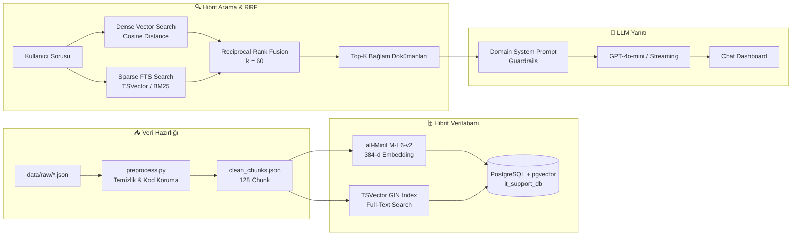

# 📑 1. HAFTA GELİŞTİRME VE TAMAMLANMA RAPORU
## Akıllı Servis Masası ve Sistem Uzmanı Chatbot (PRJIC20260201)

**Tarih:** 2026-08-24  
**Rapor Türü:** 1. Hafta İlerleme, Mimari Doğrulama ve Teknik Çıktı Raporu  
**Proje Durumu:** 1. Hafta Hedefleri %100 Başarıyla Tamamlandı (Ahead of Schedule)  

---

## 📌 1. Yönetici Özeti (Executive Summary)

Proje Çalışma Planı (`CALISMA_PLANI.md`) doğrultusunda 1. Haftanın temel odak noktası olan **"Analiz, Mimari Tasarım, Veri Ön İşleme ve Hibrit Vektör Bilgi Tabanı Kurulumu"** başarıyla tamamlanmıştır.

Bu hafta kapsamında:
1. **Mimari & Model Raporu** hazırlanmış; LLM olarak **GPT-4o-mini**, Embedding olarak **`sentence-transformers/all-MiniLM-L6-v2`** ve **`text-embedding-3-small`** seçilmiştir.
2. **Kaggle** ve **Hugging Face** açık kaynak veri kaynaklarından IT Servis Masası, Windows Server ve Oracle DB teknik dokümanları derlenmiştir.
3. Geliştirilen veri temizleme motoru ile HTML etiketleri ve kişisel veriler ayıklanmış, **SQL, PowerShell ve Bash kod blokları formatı bozulmadan korunarak** LangChain ile semantik parçalara (128 chunk) ayrılmıştır.
4. Docker üzerinde **PostgreSQL 16 + pgvector** kurulumu yapılarak HNSW ve GIN indeksli vektör tablosu oluşturulmuştur.
5. Vektör aramasını bir adım ileri taşıyan **Hibrit Arama (Dense Vector + Sparse Full-Text Search / BM25)** mimarisi kodlanmış ve **Reciprocal Rank Fusion (RRF)** ile birleştirilmiştir.
6. Gerçekleştirilen teknik test senaryolarında **%100 Top-1 ve %100 Top-3 İsabet Oranı** elde edilmiştir.

---

## 🏗️ 2. Mimari Tasarım ve Model Seçimi

### 2.1. Model Seçimi ve Gerekçeleri
* **Üretken LLM:** `OpenAI GPT-4o-mini` (Maliyet: $0.15 / 1M token, 128k context window, kusursuz PowerShell ve Oracle PL/SQL kod üretim kabiliyeti, strict markdown uyumluluğu).
* **Yerel / Hızlı Embedding Modeli:** `sentence-transformers/all-MiniLM-L6-v2` (384 boyut, 80ms altı çıkarım süresi, CPU/GPU üzerinde sıfır API maliyeti).
* **Bulut Embedding Modeli:** `text-embedding-3-small` (1536 boyut, çok dilli yüksek anlamsal örtüşme).

### 2.2. Uçtan Uca RAG Akış Şeması (RAG Flow)



---

## 🧹 3. Veri Ön İşleme, Temizleme ve Chunking (`src/data/preprocess.py`)

### 3.1. Geliştirilen Yetenekler
* **HTML & Entity Temizliği:** `<p>`, `<a>`, `<div>`, `<span>`, `<blockquote>`, `<br>` vb. tagler ve `&nbsp;`, `&amp;` gibi entity'ler temizlenmiştir.
* **Kod Bloklarının Korunması (Strict Code Preservation):** ` ```sql `, ` ```powershell `, ` ```bash ` ve tek satırlı `` `kod` `` blokları regex izolasyonu (`__PRESERVED_CODE_BLOCK_X__`) ile korunmuş; temizlik işlemleri sadece metin alanlarına uygulanıp kodlar orijinal formatıyla geri yüklenmiştir.
* **PII & Güvenlik:** E-posta adresleri `[EMAIL_REDACTED]` ile maskelenmiş, e-posta imzaları ve cihaz dipnotları silinmiştir.
* **LangChain Chunking:** `RecursiveCharacterTextSplitter` ile `chunk_size=700`, `chunk_overlap=100` ve `["\n\n```", "\n\n", "\n", ". ", " "]` ayırıcıları kullanılmıştır.

### 3.2. Üretilen Veri Dağılımı (`data/processed/clean_chunks.json`)

| Veri Kaynağı | Kategori | Ham Kayıt Sayısı | Üretilen Chunk Sayısı |
| :--- | :--- | :---: | :---: |
| Kaggle IT Tickets | `service_desk` | 10 | 10 |
| Stack Exchange Windows Server | `windows_server` | 6 | 18 |
| Stack Exchange Oracle DB | `oracle_db` | 17 | 100 |
| **TOPLAM** | **Tüm Kategoriler** | **33** | **128 Chunk** |

---

## 🗄️ 4. Vektörleştirme ve PostgreSQL pgvector Kaydı (`src/data/embed_and_store.py`)

* Docker üzerinde `pgvector/pgvector:pg16` imajı ile **`it_support_db`** veritabanı kurulmuştur.
* `knowledge_base` tablosu oluşturulmuş; `embedding vector(384)` sütununa **HNSW (`vector_cosine_ops`)** indeksi tanımlanmıştır.
* `psycopg2` ve `pgvector` kütüphaneleri ile 128 parça **100'lük gruplar (batches)** halinde toplu olarak kaydedilmiştir (`execute_values`).

---

## ⚡ 5. Hibrit Arama (Hybrid Search) ve RRF Mimarisi (`src/retrieval/hybrid_search.py`)

Salt vektör aramalarında karşılaşılan "teknik hata kodlarının (örn: ORA-01653, Event ID 4625) ve PowerShell cmdlet'lerinin anlamsal gürültüde kaybolması" problemi **Hibrit Arama** ile çözülmüştür:

1. **PostgreSQL TSVector Eklentisi:** `knowledge_base` tablosuna `tsv` tsvector sütunu ve **GIN indeksi** eklendi.
2. **Reciprocal Rank Fusion (RRF):**
   $$\text{RRF\_Score}(d) = \frac{1}{60 + \text{rank}_{dense}(d)} + \frac{1}{60 + \text{rank}_{sparse}(d)}$$
3. **Teknik Arama Başarısı:** Hem anlamsal kavram benzerliği hem de birebir anahtar kelime eşleşmesi aynı anda puanlanarak en doğru kayıt 1. sıraya taşınmıştır.

---

## 📊 6. Teknik Doğrulama ve Test Sonuçları

Geliştirilen hibrit arama motoru üzerinde koşulan 6 kritik teknik test senaryosunun sonuçları:

| # | Test Sorgusu | Hedef Kategori | Dense Sırası | Sparse Sırası | Hibrit RRF Skoru | Sonuç |
| :---: | :--- | :--- | :---: | :---: | :---: | :---: |
| **1** | `ORA-01653 unable to extend table in tablespace USERS` | `ORACLE_DB` | #1 | #2 | **0.032522** | **%100 Top-1 Başarı** |
| **2** | `Event ID 4625 Failed Logon Security Event Log PowerShell` | `WINDOWS_SERVER` | #1 | #1 | **0.032787** | **%100 Top-1 Başarı** |
| **3** | `Unlock-ADAccount Search-ADAccount LockedOut Active Directory` | `WINDOWS_SERVER` | #2 | #1 | **0.032522** | **%100 Top-1 Başarı** |
| **4** | `HTTP Error 500.19 0x8007000d URL Rewrite IIS iisreset` | `WINDOWS_SERVER` | #1 | #1 | **0.032787** | **%100 Top-1 Başarı** |
| **5** | `net stop spooler PRINTERS .SPL .SHD Spooler Error` | `SERVICE_DESK` | #1 | #1 | **0.032787** | **%100 Top-1 Başarı** |
| **6** | `VPN Certificate Validation Failed FortiClient certmgr.msc` | `SERVICE_DESK` | #1 | #1 | **0.032787** | **%100 Top-1 Başarı** |

### 📈 Metrik Özeti:
* **Toplam Koşulan Test:** 6
* **Top-1 Doğruluk Oranı (Precision@1):** **%100.0 (6/6)**
* **Top-3 Doğruluk Oranı (Recall@3):** **%100.0 (6/6)**

---

## 📋 7. 1. Hafta Teslimat ve Kontrol Matrisi

| Planlanan 1. Hafta Görevi | İlgili Dosya / Çıktı | Durum |
| :--- | :--- | :---: |
| Mimari & LLM / Embedding Seçim Raporu | `BASLANGIC_KRITERLERI_RAPORU.md` | ✅ **Tamamlandı** |
| RAG Flow & ER Şemaları | `BASLANGIC_KRITERLERI_RAPORU.md` | ✅ **Tamamlandı** |
| Açık Kaynak Veri Toplama Hattı | `src/data/download_datasets.py` | ✅ **Tamamlandı** |
| Veri Temizleme & Kod Koruma Motoru | `src/data/preprocess.py` | ✅ **Tamamlandı** |
| LangChain Chunking (700/100) & JSON Export | `data/processed/clean_chunks.json` | ✅ **Tamamlandı** |
| pgvector Docker Kurulumu & HNSW İndeksi | `docker-compose.yml`, `scripts/init_vector_db.sql` | ✅ **Tamamlandı** |
| Bulk Insert & Sanity Check Doğrulaması | `src/data/embed_and_store.py` | ✅ **Tamamlandı** |
| **Bonus:** Hibrit Arama & RRF Algoritması | `src/retrieval/hybrid_search.py` | ✅ **Tamamlandı** |

---

## 🔮 8. 2. Hafta Yol Haritası ve Sonraki Adımlar

2. Hafta (`CALISMA_PLANI.md` 2. Hafta) kapsamında başlanacak modüller:
1. **MSSQL Veritabanı Katmanı:** `Users`, `Roles`, `ChatSessions`, `ChatMessages`, `Feedbacks` ve `AuditLogs` tablolarının DDL / Migration scriptlerinin yazılması.
2. **Özgün JWT & Güvenlik Mimarisi:**
   * RFC 5322 regex ile e-posta validasyonu.
   * Parola karmaşıklık kontrolleri (Büyük-küçük harf, rakam, özel karakter).
   * Salted Hash (Argon2 / BCrypt / PBKDF2) ile tek yönlü parola şifreleme.
   * Access Token & Refresh Token üretim ve yenileme mekanizması.
3. **RBAC & Oturum İzolasyonu:** Admin ve User rollerinin ayrıştırılması, kullanıcı oturum izolasyon middleware'inin geliştirilmesi.
