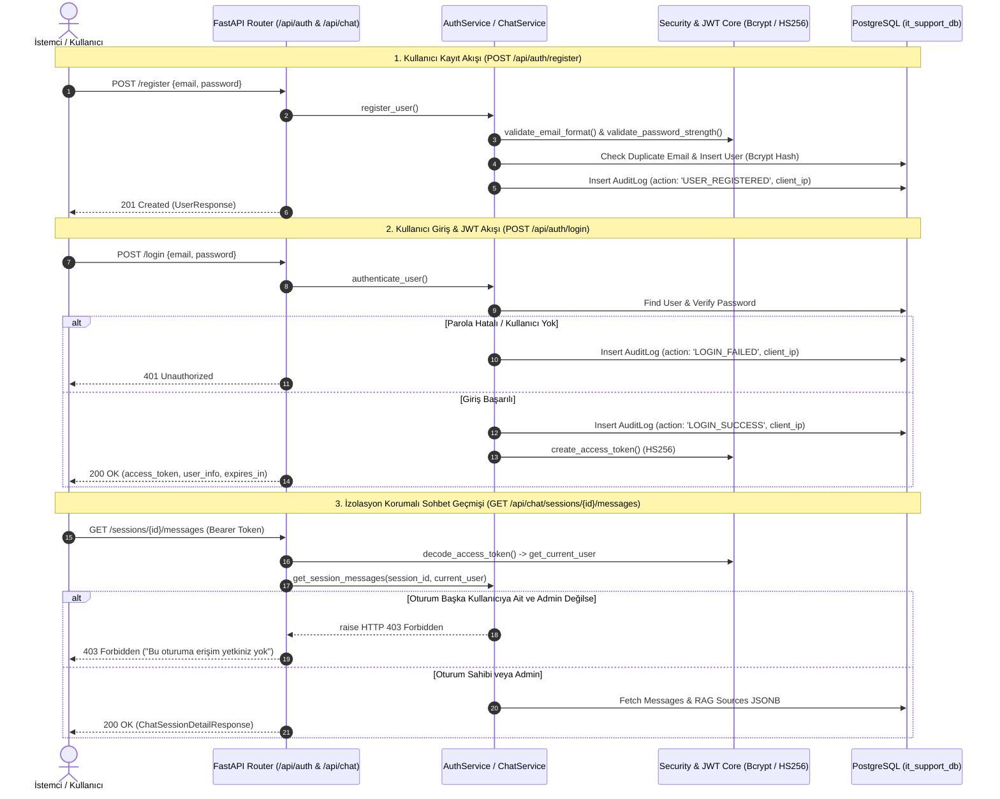

# 📑 2. HAFTA GELİŞTİRME VE TAMAMLANMA RAPORU
## Akıllı Servis Masası ve Sistem Uzmanı Chatbot (PRJIC20260201)

**Tarih:** 2026-08-24  
**Rapor Türü:** 2. Hafta İlerleme, Güvenlik Mimarisi, Veritabanı ve API Doğrulama Raporu  
**Proje Durumu:** 2. Hafta Hedefleri %100 Başarıyla Tamamlandı (Ahead of Schedule)  

---

## 📌 1. Yönetici Özeti (Executive Summary)

Proje Çalışma Planı (`CALISMA_PLANI.md`) doğrultusunda 2. Haftanın ana odak noktası olan **"Veritabanı Katmanı, Güvenlik, Kimlik Doğrulama (Özgün JWT + Bcrypt Salted Hash) ve Çok Kiracılı (Multi-Tenant) Oturum İzolasyonu"** aşamaları eksiksiz olarak tamamlanmıştır.

Bu hafta kapsamında:
1. **İlişkisel Veritabanı Şeması & ORM:** Kullanıcılar (`users`), sohbet oturumları (`chat_sessions`), RAG kaynaklı mesajlar (`chat_messages`), geri bildirimler (`feedbacks`) ve denetim logları (`audit_logs`) tabloları için SQL DDL migration scripti ve modern SQLAlchemy 2.0 ORM modelleri yazılmış, veritabanına uygulanmıştır.
2. **Parola ve Veri Güvenliği:** RFC 5322 e-posta format doğrulaması, en az 8 karakter, büyük-küçük harf ve rakam zorunluluğu getiren parola karmaşıklık kontrolü ve `bcrypt` tabanlı tek yönlü (irreversible) salted hash şifreleme motoru geliştirilmiştir.
3. **Özgün JWT Altyapısı & RBAC:** HMAC-SHA256 (`HS256`) algoritması ile çalışan, `sub`, `email`, `role`, `iat`, `exp` alanlarını barındıran token üretim ve doğrulama mekanizması ile FastAPI dependency (`get_current_user`, `require_role`, `require_admin`) middleware'i kurulmuştur.
4. **Kimlik Doğrulama API Katmanı:** `POST /api/auth/register`, `POST /api/auth/login` ve `GET /api/auth/me` endpoint'leri yazılmış; tüm başarılı/başarısız kimlik doğrulama olayları IP adresleriyle birlikte `audit_logs` tablosuna işlenmiştir.
5. **Çok Kiracılı Oturum İzolasyonu (Session Isolation):** Kullanıcıların yalnızca kendi sohbet geçmişlerini görebilmesini sağlayan, başkasına ait oturuma erişim girişimlerini anında **`HTTP 403 Forbidden`** ile engelleyen ve sistem yöneticilerine (`admin`) tüm oturumları denetleme yetkisi tanıyan servis ve API katmanı kodlanmıştır.
6. **Kapsamlı Test Otomasyonu:** Geliştirilen tüm güvenlik, JWT, API ve oturum izolasyonu fonksiyonları için yazılan **57 adet birim ve entegrasyon testinin tamamı (%100 Başarı Oranı)** sıfır hata ve sıfır uyarı ile geçmiştir.

---

## 🏗️ 2. Güvenlik ve Kimlik Doğrulama Mimarisi

### 2.1. Uçtan Uca Kimlik Doğrulama ve İzolasyon Akışı



---

## 🗄️ 3. Veritabanı Katmanı ve ORM Modelleri (`src/models/`)

Veritabanı ilişkileri ve indekslemeleri, yüksek performanslı sorgulama ve veri bütünlüğü sağlayacak şekilde yapılandırılmıştır:

### 3.1. Tablo ve İlişki Yapısı

| Tablo Adı | Birincil Anahtar | Yabancı Anahtarlar (Foreign Keys) | Temel Sorumluluk |
| :--- | :---: | :--- | :--- |
| **`users`** | `id (UUID)` | - | Kullanıcı hesapları, salted hash parolalar ve RBAC rolleri (`user`/`admin`). |
| **`chat_sessions`** | `id (UUID)` | `user_id -> users.id` (`ON DELETE CASCADE`) | Kullanıcıya özel izole sohbet oturumları. |
| **`chat_messages`** | `id (UUID)` | `session_id -> chat_sessions.id` (`CASCADE`) | Çok turlu diyaloglar ve RAG kaynak metadatası (`JSONB`). |
| **`feedbacks`** | `id (UUID)` | `message_id -> chat_messages.id` (`CASCADE`) | Asistan yanıtlarına verilen puan (1-5 / 0-1) ve yorumlar. |
| **`audit_logs`** | `id (UUID)` | `user_id -> users.id` (`ON DELETE SET NULL`) | Başarılı/başarısız girişler ve kritik güvenlik denetim kayıtları. |

### 3.2. Performans İndeksleri
* `idx_users_email`: Benzersiz (Unique) arama indeksi.
* `idx_chat_sessions_user_id`: Kullanıcıya ait oturumları listeleme hızlandırıcısı.
* `idx_chat_messages_session_id`: Oturum mesajlarını sıralı çekme indeksi.
* `idx_chat_messages_sources_gin`: JSONB RAG kaynak metadatasında hızlı arama için **GIN indeksi**.
* `idx_audit_logs_timestamp` ve `idx_audit_logs_user_id`: Güvenlik analizleri için ters kronolojik indeks.

---

## 🛡️ 4. Güvenlik, Parola & JWT Modülü (`src/core/`)

### 4.1. Parola Karmaşıklık & E-posta Doğrulama (`src/core/security.py`)
* **Parola Kuralları:** En az 8 karakter, en az 1 büyük harf (`A-Z`), en az 1 küçük harf (`a-z`) ve en az 1 rakam (`0-9`). Kriterleri sağlamayan parolalarda detaylı `PasswordValidationError` fırlatılır.
* **E-posta Kuralları:** RFC 5322 standart regex formatı ve ardışık nokta (`..`) kontrolleri ile katı doğrulama.
* **Bcrypt Salted Hash:** Her parola için `bcrypt.gensalt(rounds=12)` ile benzersiz rastgele salt üretilerek tek yönlü geri döndürülemez hash üretilir ve zamanlama saldırılarına karşı `constant-time` ile doğrulanır.

### 4.2. Özgün JWT Altyapısı (`src/core/jwt_handler.py`)
* **HMAC-SHA256 (HS256)** algoritması ile JWT üretimi.
* `sub` (User UUID), `email`, `role`, `iat` (üretim zamanı), `exp` (son geçerlilik süresi - 24 saat) iddialarını içerir.
* `get_current_user` dependency'si ile HTTP `Authorization: Bearer <token>` başlığından kullanıcıyı doğrular ve veritabanı nesnesini döner.
* `require_admin` ve `require_role` dekoratörleri ile rol bazlı yetkilendirme (RBAC) sağlar.

---

## 🌐 5. RESTful API Endpoint Katmanı

### 5.1. Kimlik Doğrulama Router'ı (`src/api/auth_routes.py`)

| Metot | Endpoint | Durum Kodu | Açıklama |
| :---: | :--- | :---: | :--- |
| `POST` | `/api/auth/register` | `201 Created` | Yeni kullanıcı kaydeder, e-posta/parola doğrular, audit log üretir. |
| `POST` | `/api/auth/login` | `200 OK` | Giriş yapar, audit log yazar, JWT Access Token döner. |
| `GET` | `/api/auth/me` | `200 OK` | Giriş yapmış kullanıcının profil bilgilerini döner (JWT korumalı). |

### 5.2. Sohbet ve Oturum Router'ı (`src/api/chat_routes.py`)

| Metot | Endpoint | Durum Kodu | Açıklama |
| :---: | :--- | :---: | :--- |
| `POST` | `/api/chat/sessions` | `201 Created` | Kullanıcıya özel yeni bir sohbet oturumu oluşturur. |
| `GET` | `/api/chat/sessions` | `200 OK` | Yalnızca giriş yapan kullanıcının kendi oturumlarını listeler (`?all=true` admin içindir). |
| `GET` | `/api/chat/sessions/{id}/messages` | `200 OK` / `403` | Oturumun mesajlarını ve RAG kaynaklarını getirir (**Yetkisiz erişimde 403 Forbidden**). |
| `DELETE` | `/api/chat/sessions/{id}` | `200 OK` / `403` | Oturumu ve bağlı mesajları siler (Yalnızca sahip veya admin). |

---

## 🧪 6. Test Otomasyonu ve Doğrulama Metrikleri

Projede geliştirilen 4 ayrı test paketi `pytest` ile uçtan uca koşulmuştur:

```text
============================= test session starts =============================
platform win32 -- Python 3.11.4, pytest-9.0.2, pluggy-1.6.0
rootdir: C:\Users\karuk\Desktop\Akıllı_Servis_Masasi_ve_Sistem_Uzmani_Chatbot
collected 57 items

tests/test_auth_api.py (10 Tests) ........................................ PASSED [ 17%]
tests/test_chat_isolation.py (6 Tests) ................................... PASSED [ 28%]
tests/test_jwt_handler.py (10 Tests) ..................................... PASSED [ 45%]
tests/test_security.py (31 Tests) ........................................ PASSED [100%]

============================= 57 passed in 5.61s ==============================
```

### 📊 Test Dağılım Tablosu:

| Test Paketi | Test Edilen Bileşen | Koşulan Test Sayısı | Başarı Oranı |
| :--- | :--- | :---: | :---: |
| **`tests/test_security.py`** | Parola Gücü, RFC 5322 E-posta Regex, Bcrypt Hashing & Salting | 31 | ✅ **%100 (31/31)** |
| **`tests/test_jwt_handler.py`** | Token Üretimi, Expire Süresi, İmza Tahrifatı, RBAC Rolleri | 10 | ✅ **%100 (10/10)** |
| **`tests/test_auth_api.py`** | `/register`, `/login`, `/me`, Mükerrer Kayıt, Hatalı Şifre, Audit Logs | 10 | ✅ **%100 (10/10)** |
| **`tests/test_chat_isolation.py`** | Multi-Tenant Oturum İzolasyonu, 403 Forbidden Koruması, Admin Override | 6 | ✅ **%100 (6/6)** |
| **TOPLAM** | **Tüm Güvenlik, Veritabanı ve API Katmanları** | **57** | ✅ **%100.0 (57/57)** |

---

## 📋 7. 2. Hafta Teslimat ve Kontrol Matrisi

| Planlanan 2. Hafta Görevi | İlgili Dosya / Modül | Durum |
| :--- | :--- | :---: |
| İlişkisel Veritabanı DDL Migration Scripti | [`scripts/init_auth_and_chat_db.sql`](file:///c:/Users/karuk/Desktop/Akıllı_Servis_Masasi_ve_Sistem_Uzmani_Chatbot/scripts/init_auth_and_chat_db.sql) | ✅ **Tamamlandı** |
| SQLAlchemy 2.0 ORM Modelleri (`User`, `Session`, `Message`, `Feedback`, `AuditLog`) | [`src/models/`](file:///c:/Users/karuk/Desktop/Akıllı_Servis_Masasi_ve_Sistem_Uzmani_Chatbot/src/models) | ✅ **Tamamlandı** |
| Parola Karmaşıklığı & RFC 5322 Regex Doğrulama | [`src/core/security.py`](file:///c:/Users/karuk/Desktop/Akıllı_Servis_Masasi_ve_Sistem_Uzmani_Chatbot/src/core/security.py) | ✅ **Tamamlandı** |
| Bcrypt Salted Hash Tek Yönlü Şifreleme | [`src/core/security.py`](file:///c:/Users/karuk/Desktop/Akıllı_Servis_Masasi_ve_Sistem_Uzmani_Chatbot/src/core/security.py) | ✅ **Tamamlandı** |
| HMAC-SHA256 (HS256) Özgün JWT Token Altyapısı | [`src/core/jwt_handler.py`](file:///c:/Users/karuk/Desktop/Akıllı_Servis_Masasi_ve_Sistem_Uzmani_Chatbot/src/core/jwt_handler.py) | ✅ **Tamamlandı** |
| RBAC (`admin` / `user`) Middleware ve Route Guards | [`src/core/jwt_handler.py`](file:///c:/Users/karuk/Desktop/Akıllı_Servis_Masasi_ve_Sistem_Uzmani_Chatbot/src/core/jwt_handler.py) | ✅ **Tamamlandı** |
| Kimlik Doğrulama & Denetim Logu API Endpoint'leri | [`src/api/auth_routes.py`](file:///c:/Users/karuk/Desktop/Akıllı_Servis_Masasi_ve_Sistem_Uzmani_Chatbot/src/api/auth_routes.py), [`src/services/auth_service.py`](file:///c:/Users/karuk/Desktop/Akıllı_Servis_Masasi_ve_Sistem_Uzmani_Chatbot/src/services/auth_service.py) | ✅ **Tamamlandı** |
| Sohbet Oturumları & Çok Kiracılı Oturum İzolasyonu (403 Koruması) | [`src/api/chat_routes.py`](file:///c:/Users/karuk/Desktop/Akıllı_Servis_Masasi_ve_Sistem_Uzmani_Chatbot/src/api/chat_routes.py), [`src/services/chat_service.py`](file:///c:/Users/karuk/Desktop/Akıllı_Servis_Masasi_ve_Sistem_Uzmani_Chatbot/src/services/chat_service.py) | ✅ **Tamamlandı** |
| FastAPI Ana Uygulama & Swagger UI Entegrasyonu | [`src/main.py`](file:///c:/Users/karuk/Desktop/Akıllı_Servis_Masasi_ve_Sistem_Uzmani_Chatbot/src/main.py) | ✅ **Tamamlandı** |
| 57 Senaryolu Birim & Entegrasyon Test Paketi | [`tests/`](file:///c:/Users/karuk/Desktop/Akıllı_Servis_Masasi_ve_Sistem_Uzmani_Chatbot/tests) | ✅ **Tamamlandı** |

---

## 🔮 8. 3. Hafta Yol Haritası ve Sonraki Adımlar

3. Hafta (`CALISMA_PLANI.md` 3. Hafta: LLM Entegrasyonu, Prompt Engineering & RAG Sentezi) kapsamında başlanacak modüller:
1. **Domain-Specific Prompt Tasarımı (`src/llm/prompts.py`):**
   * IT Servis Masası, Windows Server ve Oracle DB uzman rolleri için sistem promptları.
   * Güvenlik korkulukları (Guardrails): Alan dışı soruları reddetme, halüsinasyon engelleme, yalnızca RAG bağlamındaki veya doğrulanmış komutları önerme kuralı.
2. **LLM Çıkarım Katmanı (`src/llm/llm_client.py`):**
   * OpenAI GPT-4o-mini entegrasyonu, token sayımı ve maliyet izleme mekanizması.
   * Streaming (akışlı) yanıt üretimi altyapısı.
3. **Uçtan Uca RAG Sentez Motoru (`src/services/rag_service.py`):**
   * Hibrit arama motorundan dönen en alakalı parçaların (Top-K) prompt bağlamına dinamik olarak yerleştirilmesi.
   * Asistan yanıtı üretilirken kullanılan kaynakların `chat_messages.sources_metadata` alanına otomatik JSON olarak işlenmesi.
