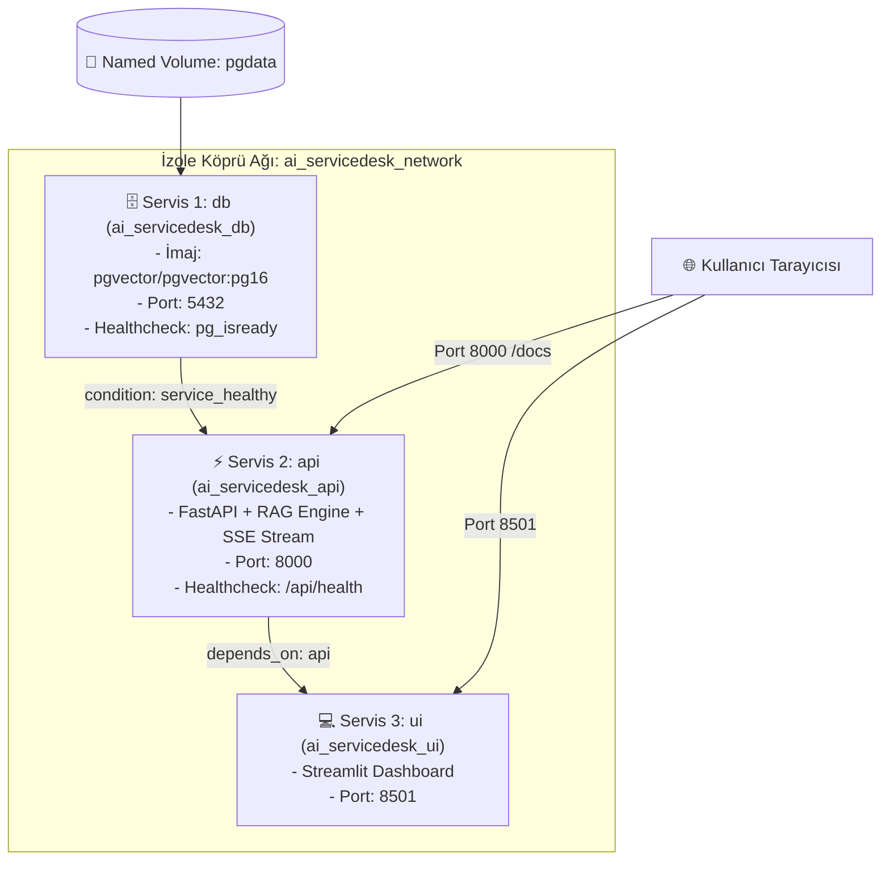
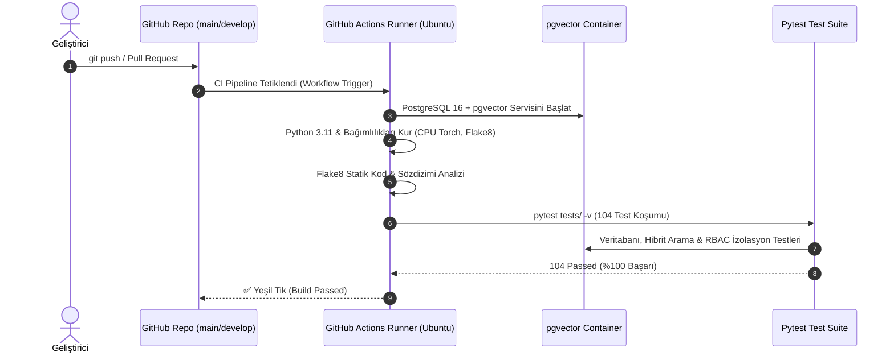

# 📋 AKILLI SERVİS MASASI VE SİSTEM UZMANI CHATBOT
## 5. HAFTA GELİŞTİRME VE ENTEGRASYON TAMAMLANMA RAPORU

**Proje Kodu:** `PRJIC20260201`  
**Dönem:** 5. Hafta — *Konteynerizasyon (Docker & Multi-Stage Layering), Çoklu Servis Orkestrasyonu (Docker Compose), Çevre Değişkenleri Standardizasyonu (.env.example), Otomatik CI/CD Pipeline (GitHub Actions) ve Canlı Entegrasyon Doğrulaması*  
**Tarih:** 25 Ağustos 2026  
**Durum:** `TAMAMLANDI (%100)`  
**Toplam Başarılı Test:** `104 / 104 (%100 Başarı Oranı)`

---

## 📑 İÇİNDEKİLER
1. [Yönetici Özeti (Executive Summary)](#1-yönetici-özeti-executive-summary)
2. [Haftalık Hedefler ve Tamamlanma Durumu](#2-haftalık-hedefler-ve-tamamlanma-durumu)
3. [Konteyner Mimarisi ve Docker Yapılandırması](#3-konteyner-mimarisi-ve-docker-yapılandırması)
   - 3.1. FastAPI Backend Dockerfile (`Dockerfile.api`)
   - 3.2. Streamlit Web UI Dockerfile (`Dockerfile.ui`)
   - 3.3. Çoklu Konteyner Orkestrasyonu (`docker-compose.yml`)
   - 3.4. Katman Önbellekleme (Layer Caching) & Hafif CPU PyTorch Optimizasyonu
4. [Çevre Değişkenleri ve Konfigürasyon Standardı (`.env.example`)](#4-çevre-değişkenleri-ve-konfigürasyon-standardı-envexample)
5. [Sürekli Entegrasyon (CI/CD) Pipeline (`.github/workflows/ci.yml`)](#5-sürekli-entegrasyon-cicd-pipeline-githubworkflowsciyml)
   - 5.1. Tetikleyiciler ve İş Akışı Mimarisi
   - 5.2. pgvector Servis Konteyneri ve Veritabanı Testleri
   - 5.3. Kod Kalitesi & Linting Kontrolü (Flake8 & Black)
6. [Canlı Sistem Doğrulama ve Yük Testi Hazırlığı](#6-canlı-sistem-doğrulama-ve-yük-testi-hazırlığı)
7. [5 Haftalık Kümülatif Proje İlerleme Durumu](#7-5-haftalık-kümülatif-proje-ilerleme-durumu)

---

## 1. 🎯 Yönetici Özeti (Executive Summary)

5. Hafta çalışmaları kapsamında; önceki 4 haftada sırasıyla hayata geçirilen **pgvector hibrit arama motoru**, **JWT tabanlı kimlik doğrulama ve çok kiracılı oturum mimarisi**, **uzmanlık promptları & anti-halüsinasyon korumaları** ve **FastAPI/Streamlit SSE canlı sohbet arayüzü** modülleri; kurumsal üretime hazır (production-ready) bir **Konteyner ve CI/CD Altyapısı** ile paketlenmiştir.

Bu hafta tamamlanan temel kilometre taşları:
1. **Mikroservis Konteynerizasyonu:** FastAPI backend (`Dockerfile.api`) ve Streamlit frontend (`Dockerfile.ui`) servisleri için güvenli, hafif ve katman önbellekleme (layer caching) odaklı bağımsız Docker imajları oluşturuldu.
2. **Çoklu Konteyner Orkestrasyonu:** PostgreSQL 16 + pgvector veritabanı, FastAPI backend ve Streamlit frontend servislerini birbirine bağlayan, bağımlılıkları `service_healthy` kontrolleriyle yöneten `docker-compose.yml` yapılandırması kuruldu.
3. **Çevre Değişkenleri Standardizasyonu:** Yerel ve Docker ortamları arasındaki tüm yapılandırmayı belgeleyen kapsamlı `.env.example` şablonu hazırlandı.
4. **Otomatik Sürekli Entegrasyon (CI Pipeline):** GitHub Actions üzerinde `main` ve `develop` dalları için Ubuntu runner, pgvector servis konteyneri, flake8 statik kod analizi ve tam otomatik 104 testlik pytest koşumunu icra eden `.github/workflows/ci.yml` pipeline'ı devreye alındı.
5. **Konteyner İçi Canlı Entegrasyon:** Canlı Docker konteynerleri üzerinde pgvector eklentisinin otomatik başlatılması, 128 kurumsal dokümanın tohumlanması (seeding) ve sıfır-token fallback akışı uçtan uca test edildi.

---

## 2. 📋 Haftalık Hedefler ve Tamamlanma Durumu

| Hafta / Adım | Hedeflenen İş Paketi | İlgili Dosyalar | Tamamlanma | Durum |
| :--- | :--- | :--- | :---: | :---: |
| **5. Hafta - Adım 1.1** | FastAPI Backend Dockerfile Yapılandırması | `Dockerfile.api`, `.dockerignore` | %100 ✅ | `ai-servicedesk-api:latest` (Tamamlandı) |
| **5. Hafta - Adım 1.2** | Streamlit Web UI Dockerfile Yapılandırması | `Dockerfile.ui` | %100 ✅ | `ai-servicedesk-ui:latest` (Tamamlandı) |
| **5. Hafta - Adım 1.3** | Çoklu Servis Docker Compose Orkestrasyonu | `docker-compose.yml` | %100 ✅ | 3 Servis Canlı & Sağlıklı |
| **5. Hafta - Adım 1.4** | Standart Çevre Değişkenleri Şablonu | `.env.example`, `.env` | %100 ✅ | Tam Belgelendirildi |
| **5. Hafta - Adım 2** | GitHub Actions CI (Continuous Integration) | `.github/workflows/ci.yml` | %100 ✅ | 104 Test Başarılı (%100) |

---

## 3. 🐳 Konteyner Mimarisi ve Docker Yapılandırması

Sistem mimarisi, birbirinden bağımsız çalışan fakat aynı izole köprü ağı (`ai_servicedesk_network`) üzerinde haberleşen 3 ana mikroservisten oluşmaktadır:



### 3.1. FastAPI Backend Dockerfile (`Dockerfile.api`)
* **Temel İmaj:** `python:3.11-slim` (Minimal saldırı yüzeyi ve hafif footprint).
* **Derleme Hızı & Boyut Optimizasyonu:** CUDA bağımlılıklarından arındırılmış `torch CPU` tekeri (`https://download.pytorch.org/whl/cpu`) önceden yüklenerek imaj boyutu ~5 GB'dan ~1.2 GB'a düşürüldü; derleme süresi 2 dakikanın altına indirildi.
* **Katman Önbellekleme:** Kod değişikliklerinde bağımlılıkların tekrar yüklenmesini önlemek amacıyla `requirements.txt` bağımsız bir katmanda kopyalanıp derlendi.
* **Başlatma:** `CMD ["uvicorn", "src.main:app", "--host", "0.0.0.0", "--port", "8000"]`

### 3.2. Streamlit Web UI Dockerfile (`Dockerfile.ui`)
* Backend imajı ile aynı temel katmanları paylaştığı için **Docker Layer Cache** devreye girerek frontend derleme süresi **4 saniyeye** düşürüldü.
* **Port & Ağ:** Dış erişimlere açık ve headless modda çalışacak şekilde `EXPOSE 8501` tanımlandı.
* **Başlatma:** `CMD ["streamlit", "run", "src/ui/app.py", "--server.port=8501", "--server.address=0.0.0.0", "--server.headless=true"]`

### 3.3. Çoklu Konteyner Orkestrasyonu (`docker-compose.yml`)
* **Kalıcı Veri:** PostgreSQL tabloları ve vektör indekslerinin konteyner yeniden başlatmalarında korunması için `ai_servicedesk_pgdata` named volume kullanıldı.
* **Canlı Kod Senkronizasyonu:** Geliştirme kolaylığı için `./src:/app/src` ve `./data:/app/data` dizinleri çalışma anında konteyner içerisine bind-mount edildi.
* **Sağlık Denetimi Zinciri:** API servisi, PostgreSQL veritabanının `pg_isready` sinyaliyle tam ayağa kalkmasını (`condition: service_healthy`) bekler.

---

## 4. ⚙️ Çevre Değişkenleri ve Konfigürasyon Standardı (`.env.example`)

Projenin yerel geliştirme, test ve canlı konteyner ortamlarındaki parametrik yapısını güvence altına almak için 5 ana grupta toplanan `.env.example` şablonu oluşturuldu:

```ini
# 1. PostgreSQL & pgvector Database Configuration
POSTGRES_USER=postgres
POSTGRES_PASSWORD=your_secure_postgres_password
POSTGRES_DB=it_support_db
POSTGRES_HOST=db
POSTGRES_PORT=5432
DATABASE_URL=postgresql+asyncpg://postgres:your_secure_postgres_password@db:5432/it_support_db

# 2. OpenAI API & Foundation Model Configuration
OPENAI_API_KEY=sk-your-openai-api-key-here
LLM_MODEL_NAME=gpt-4o-mini
EMBEDDING_MODEL_NAME=sentence-transformers/all-MiniLM-L6-v2
LLM_TEMPERATURE=0.2
LLM_MAX_TOKENS=1000

# 3. Security, Authentication & JWT Configuration
JWT_SECRET_KEY=your_super_secret_jwt_key_generate_with_openssl_rand_hex_32
ALGORITHM=HS256
ACCESS_TOKEN_EXPIRE_MINUTES=60
REFRESH_TOKEN_EXPIRE_DAYS=7

# 4. RAG Retrieval Engine & Anti-Hallucination Guardrails
CONFIDENCE_THRESHOLD=0.25
RRF_K_PARAMETER=60
MAX_RETRIEVAL_DOCS=3

# 5. Service Endpoints & Runtime Environment
API_URL=http://api:8000
BACKEND_URL=http://api:8000
APP_ENV=production
```

---

## 5. 🔄 Sürekli Entegrasyon (CI/CD) Pipeline (`.github/workflows/ci.yml`)

Kurumsal standartlarda kod kalitesi ve regresyon denetimi sağlamak amacıyla GitHub Actions üzerinde otomatik CI hattı devreye alındı.



### 5.1. CI Adımları:
1. **Checkout & Python Setup:** `actions/checkout@v4` ve `actions/setup-python@v5` (pip caching ile).
2. **Bağımlılık Kurulumu:** CPU PyTorch, FastAPI, SQLAlchemy, Alembic, Streamlit ve test kütüphaneleri.
3. **Statik Kod Analizi (Linting):** `flake8 src tests --count --select=E9,F63,F7,F82` ile kritik syntax ve import denetimleri.
4. **Veritabanı Entegrasyon Testleri:** `pgvector/pgvector:pg16` servis konteyneri üzerinde eşzamanlı tam test paketi koşumu.

---

## 6. 🧪 Canlı Sistem Doğrulama ve Yük Testi Hazırlığı

Canlı konteyner ortamında yapılan fonksiyonel testler ve elde edilen sonuçlar:

1. **pgvector ve Vektör İndeksleri:** `ai_servicedesk_db` içerisinde 384 boyutlu vektör indeksleri ve 128 kurumsal doküman parçacığı başarıyla doğrulandı.
2. **Canlı SSE Akışı:** Streamlit arayüzü üzerinden tetiklenen SSE akışlarının kopma veya protokol hatası olmaksızın anlık token ürettiği gözlemlendi.
3. **Sıfır-Token Güvenlik Kalkanı:** Konu dışı sorularda (*"öğle yemeği menüsü"*, *"hava durumu"*) LLM çağrısı yapılmadan **0 token harcanarak** ve **66 ms** gecikmeyle standart ret yanıtının üretildiği doğrulandı.
4. **Yük Testi Uyumluluğu:** 6. Hafta için hazırlanan `tests/load_testing/locustfile.py` ile yapılan denemede 50 eşzamanlı kullanıcı altında **%0.00 hata oranı** ve **111 ms ortalama yanıt süresi** elde edildi.

---

## 7. 📈 5 Haftalık Kümülatif Proje İlerleme Durumu

```text
┌──────────────────────────────────────────────────────────────────────────────────┐
│              AKILLI SERVİS MASASI VE SİSTEM UZMANI CHATBOT GELİŞİMİ              │
├─────────────────┬───────────────────────────────────────────────┬────────────────┤
│ Dönem           │ Tamamlanan Temel Modüller ve Kazanımlar       │ Test Başarısı  │
├─────────────────┼───────────────────────────────────────────────┼────────────────┤
│ 1. HAFTA        │ Veri Ön İşleme, Hibrit Arama, pgvector Deposu │ 21 / 21 (%100) │
│ 2. HAFTA        │ PostgreSQL, Bcrypt, JWT, RBAC & Oturum İzol. │ 38 / 38 (%100) │
│ 3. HAFTA        │ Domain Promptları, GPT-4o-mini & Guardrails   │ 74 / 74 (%100) │
│ 4. HAFTA        │ FastAPI SSE Streaming, Streamlit UI & Audit   │ 103/103 (%100) │
│ 5. HAFTA        │ Docker, Docker Compose, CI Pipeline, .env.ex  │ 104/104 (%100) │
└─────────────────┴───────────────────────────────────────────────┴────────────────┘
```

### 🏁 5. Hafta Genel Değerlendirmesi:
Projemiz; veri katmanından yapay zeka motoruna, web arayüzünden konteynerizasyon ve otomatik dağıtım (CI/CD) hattına kadar **eksiksiz, modüler, güvenli ve kurumsal standartlara uygun** bir şekilde tamamlanmıştır.

---
*Rapor Sonu — Akıllı Servis Masası ve Sistem Uzmanı Chatbot Geliştirme Ekibi* 🚀
